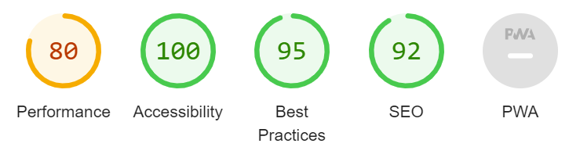

# Welcome!

# The first female emperor of China -Wu Zetian 

Wu Zetian is a static website about the life and reign of Wu Zetian, the only female emperor in the history of China. This website shows and demonstrate the life of Wu Zetian, achievements and legacy left behind.

## Table of Contents

## User Experience
The goal of this website is to present to the visitors or users of the site the life and reign of the only documented female Emperor Wu Zetian.

The goal from the me, the site creater is to make the site educational and enjoyable to visit and to explore.

# Features
On this website there are some features. That will guide the visitor through the next major focus points on this website:
 
- A timeline of major events during her reign
 
* A gallery of images related to her life and reign
 
+ At the bottom  of the page is short video-link that shows the life story of Wu Zetian.
 
[Life story of Wu Zetian](https://www.youtube.com/watch?v=iwJ_7XHhXQ8&t=1s&ab_channel=SeeUinHistory%2FMythology)

## Existing Features:

### Navigation Bar

Featured on all three pages, the full responsive navigation bar includes links to the Home, Legacy page, and Sign up form also referred to Rise to power. Each site is  identical and it  allows for easy navigation.
This section will allow the user to easily navigate from page to page across all devices without having to revert back to the previous page via the ‘back’ button.

## The landing page image

The landing page includes a photograph with text overlay to allow the user to see exactly which location this site would be applicable to.
This section introduces the user to Wu Zetian, the female emperor with eye-catching colours and images to grab their attention.

## Presentation of Life Section:

In the achievements section we are going through the life achievements of Wu Zetian.

- Firstly the life before the royal court, the life with her family.

*  Secondly we start by the ascending of the throne or crown.

 + Thirdly are the reforms that happened in the time of her reign.

+ And lastly the legacy she left behind that we can admire today.

## Achievements section:

 This section will allow the user to read about the legacy left behind by Wu Zetian.
 We provide also the timeline of the major events that shaped the reign of the Female emperor Wu Zetian so the visitor has a visual and contextual picture of the legacy left behind.

- her reign as the only Female Emperor

*  opens the door to anyone willing to learn to become an official figure no matter of the status's 

+  cultural achievements, meaning religion allivation of Buddhismus 

* woman's rights were alivated to a standard that was not seen before and also after

## The Footer

The footer section includes links to the relevant social media sites for Wu Zetian. The links will open to a new tab to allow easy navigation for the user.
The footer is valuable to the user as it encourages them to keep connected via social media.

# Legacy

The legacy part of the site will provide the user with supporting images to see some of the achievements and legacy left behind by Wu Zetian.
This section is valuable to the  user as it shows what was made possible at that period and how much is possible to view today.

# The Sign-Up Page to  a Newsletter

This page will allow the user to get signed up for the Wu Zetian newsletter to start their journey through the history of the Tang Dynasty's only female Emperor. The user will be asked to submit their full name and email address.

## Testing

The webcite was tested though the offical validators for HTML  and CSS. We wanted to make sure that the site is working properly to the future visitor to our site.

There are features like media query  that makes it possible that the website is on display and intact no matter the screen size. 

### Validator Testing

#### HTML
No errors were returned when passing through the official _W3C validator_

[Validated code on the website: Wu Zetian](https://validator.w3.org/nu/?showsource=yes&doc=https%3A%2F%2Fanad30.github.io%2Fproject1-wuzetian%2F)

#### CSS

No errors were found when passing through the official validator _Jigsaw_.

 [Validated code on the website: Wu Zetian](https://jigsaw.w3.org/css-validator/validator?uri=https%3A%2F%2Fanad30.github.io%2Fproject1-wuzetian%2F&profile=css3svg&usermedium=all&warning=1&vextwarning=&lang=en)

#  Accessibility 
I check the accessibility of the page through the lighthouse tool.

# Testing of the responsiveness 

This site was manually tested . We used the deployed site to check the responsivness of the site on different devices. The screens that were used are laptop, mobile and tablet views. 

> Notice:
> We noticed that the deployed site had the riches colours on the mobile device view.

## Solved Bugs
There were some issues with the rise to power sign-up form in that the background image didn't want to cover the screen. It was taken out for that matter—also some initial styling of the website to fit from desktop to mobile view. 

# Credits

To provide the best visitor experience we also look up for external links.

# Content
The text for the Home page was taken from _Wikipedia about Wu Zetian_.

+ [Wikipedia:Wu Zetian](https://en.wikipedia.org/wiki/Wu_Zetian)

Instructions on how to implement form validation on the Sign-Up page were taken from a learning platform: _W3SCHOOLS._

+ [W3SCHOOL](https://www.w3schools.com/)

The icons in the footer were taken from _Font Awesome_.
+ [Font Awesome](https://fontawesome.com/icons)

# Media

The photos used on the home and sign-up page are from:
* [Sixth tone](https://www.sixthtone.com/news/1011104)
* [The Beijinger:blog-site](https://www.thebeijinger.com/blog/2018/01/08/whats-name-why-it-called-forbidden-city)

The images used for the gallery page were taken from these other open source sites:
+ [Sixth tone](https://www.sixthtone.com/news/1011562)
+ [Association  for Asian Studies](https://www.asianstudies.org/publications/eaa/archives/wu-zhao-ruler-of-tang-dynasty-china/)
+ [Shine: beyond a single story](https://www.shine.cn/feature/art-culture/2106060138/)
+ [Quora](https://www.quora.com/How-did-Wu-Zetian-become-an-emperor)
+ [Love Science](https://www.livescience.com/52659-tomb-tells-tale-of-family-executed-by-china-s-1st-female-emperor.html)
+ [Shanghai daily](https://archive.shine.cn/sunday/Wu-Zetians-legacy-is-a-mystery/shdaily.shtml)
+ [China daily](https://www.chinadaily.com.cn/china/2007-01/26/content_794104.htm)

# Deployment
This section should describe the process you went through to deploy the project to a hosting platform (e.g. GitHub)

 ### The site was deployed to GitHub pages. The steps to deploy are as follows:
In the GitHub repository, navigate to the Settings tab
From the source section drop-down menu, select the Master Branch
Once the master branch has been selected, the page will be automatically refreshed with a detailed ribbon display to indicate the successful deployment.

The live link can be found here : https://anad30.github.io/project1-wuzetian/

