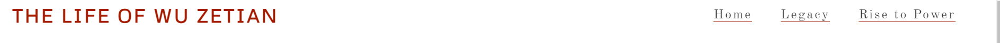
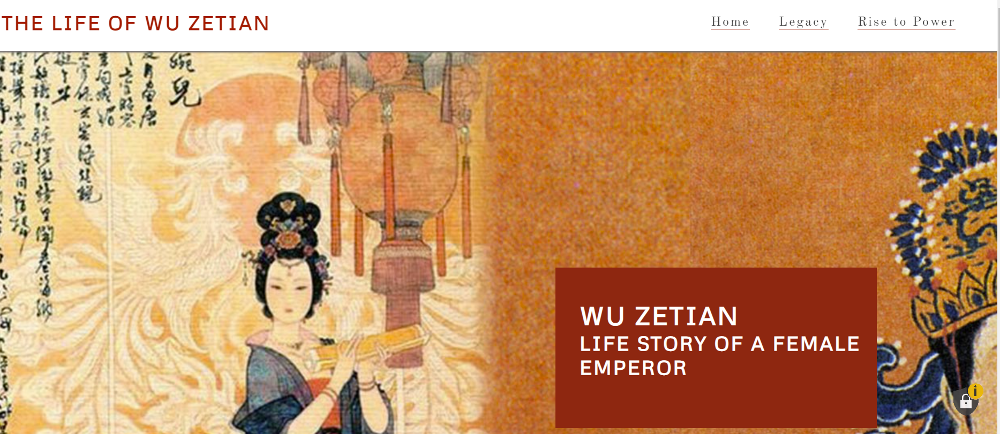
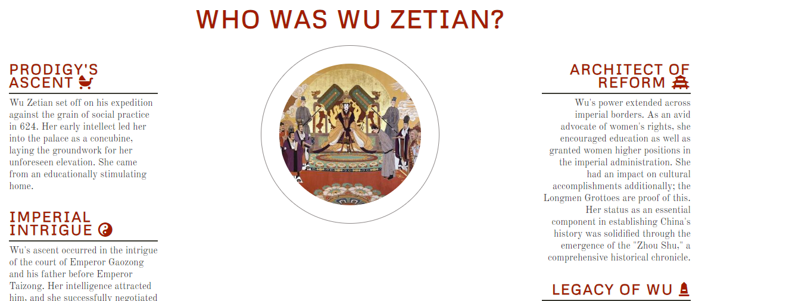
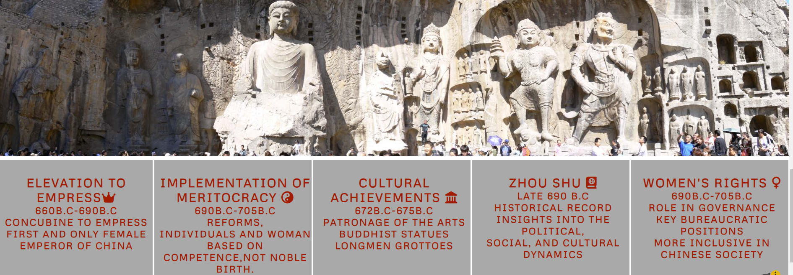

# Welcome!

# The first female emperor of China -Wu Zetian 

Wu Zetian is a static website about the life and reign of Wu Zetian, the only female emperor in the history of China. This website shows and demonstrate ´the life of Wu Zetian, her life and achievements.

## Table of Contents

# Features
On this website there are some features. That will guide the visitor through the next major focus points on this website:
 
•A timeline of major events during her reign
 
•A gallery of images related to her life and reign
 
•At the bottom  of the page is short video-link that shows the life story of Wu Zetian.
[Wu Zetian(https://www.youtube.com/watch?v=iwJ_7XHhXQ8&t=1s&ab_channel=SeeUinHistory%2FMythology)]

## Existing Features:

### Navigation Bar

Featured on all three pages, the full responsive navigation bar includes links to the Home, legacy page, and Sign Up page(early life and rise to power) and is identical in each page to allow for easy navigation.
This section will allow the user to easily navigate from page to page across all devices without having to revert back to the previous page via the ‘back’ button.

## The landing page image

The landing includes a photograph with text overlay to allow the user to see exactly which location this site would be applicable to.
This section introduces the user to Love Running with an eye catching animation to grab their attention.

## Presentation of Life Section:

The achievements section we are going thru the life or better said life achievments of Wu Zetian.
- Firstly the life before the royal cort, just life withe the family.

- Secondly we start by the ascending of the throne or crown.

- Thirdly are the reforms that happened in the time of her reign.

- And the last the legacy she left beheind to look and admire till today.

## Achievements section:

 This section will allow the user to read about the legacy left behind by Wu Zetian.
 We provide also the timeline of the major events that shaped the reign of the Female emperor so the visitor has a visual and contextual picture of the Tang dynasty and later Zhou dynasty.

 
•her reign in it as the only Female Emperor
 
•implementation of knowledge before,privilege of royal blood
 
•cultural achievements, meaning religion allivation of Buddhismus 
 
•woman's rights were alivated to a standard that was not seen before and also after

<h2>The Footer</h2>

The footer section includes links to the relevant social media sites for Wu Zetian. The links will open to a new tab to allow easy navigation for the user.
The footer is valuable to the user as it encourages them to keep connected via social media

## Testing

In this section, you need to convince the assessor that you have conducted enough testing to legitimately believe that the site works well. Essentially, in this part you will want to go over all of your project’s features and ensure that they all work as intended, with the project providing an easy and straightforward way for the users to achieve their goals.

In addition, you should mention in this section how your project looks and works on different browsers and screen sizes.

You should also mention in this section any interesting bugs or problems you discovered during your testing, even if you haven't addressed them yet.

If this section grows too long, you may want to split it off into a separate file and link to it from here.

### Validator Testing

#### HTML
No errors were returned when passing through the official W3C validator

[https://validator.w3.org/]  W3C validator

#### CSS

No errors were found when passing through the official validator.

[https://jigsaw.w3.org/css-validator/](Jigsaw) 

You will need to mention unfixed bugs and why they were not fixed. This section should include shortcomings of the frameworks or technologies used. Although time can be a big variable to consider, paucity of time and difficulty understanding implementation is not a valid reason to leave bugs unfixed.

# Credits
In this section you need to reference where you got your content, media and extra help from. It is common practice to use code from other repositories and tutorials, however, it is important to be very specific about these sources to avoid plagiarism.

You can break the credits section up into Content and Media, depending on what you have included in your project.

# Content
The text for the Home page was taken from Wikipedia Article A
Instructions on how to implement form validation on the Sign Up page was taken from Specific YouTube Tutorial
The icons in the footer were taken from Font Awesome
Media
The photos used on the home and sign up page are from This Open Source site
The images used for the gallery page were taken from this other open source site
Congratulations on completing your Readme, you have made another big stride in the direction of being a developer!

